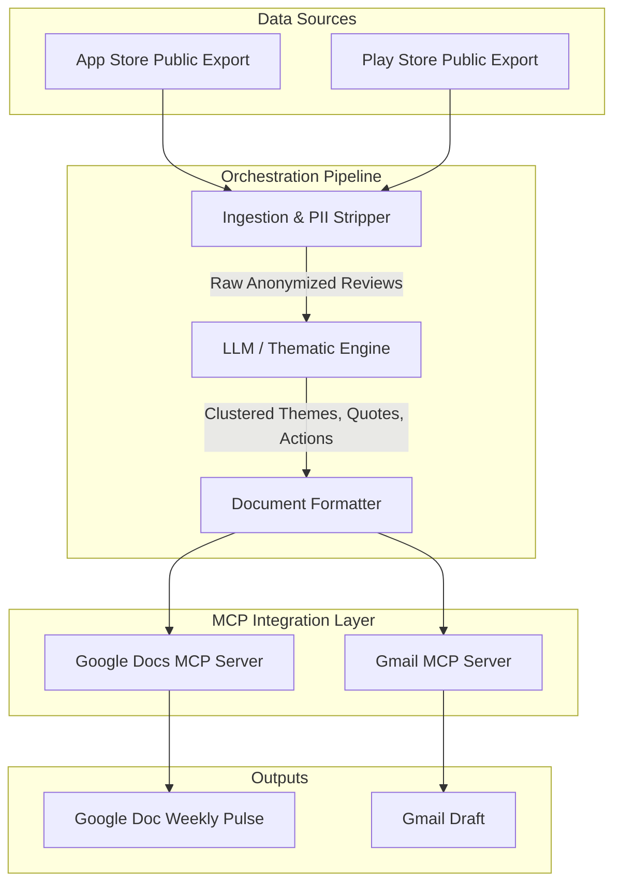

# Architecture: Automated Weekly Review Pulse

## 1. System Overview
The system is an automated, weekly pipeline that ingests public app reviews, processes them using a Large Language Model (LLM) to generate thematic insights, and distributes the findings via Google Docs and Gmail. The architecture relies on the **Model Context Protocol (MCP)** to interact with Google services securely, abstracting away direct OAuth and REST API complexities.

## 2. High-Level Architecture Diagram

## 3. Component Design

### 3.1 Data Ingestion Module
- **Purpose**: Load reviews from public exports (e.g., CSV, JSON) covering the last 8-12 weeks.
- **Responsibilities**:
  - Filter reviews by date range.
  - Extract essential fields: `rating`, `title`, `text`, `date`.
  - **Privacy Enforcement**: Scrub any identifiable reviewer data (PII) before passing it to the processing engine.

### 3.2 Processing Engine (LLM)
- **Purpose**: Analyze the raw text and generate structured insights.
- **Responsibilities**:
  - **Clustering**: Group all reviews into a maximum of 5 distinct themes (e.g., *onboarding, KYC, payments, withdrawals, bugs*).
  - **Summarization**: Distill the clustered data into a weekly note highlighting the **Top 3 themes**.
  - **Quote Extraction**: Select 3 *verbatim* user quotes directly from the text.
  - **Action Generation**: Propose 3 concrete next steps grounded in the themes.
- **Constraints**: Ensure the generated note is highly scannable and ≤ 250 words.

### 3.3 Integration Layer (MCP-First)
Rather than building bespoke REST clients, the system utilizes **MCP servers** to communicate with external tools natively.
- **Google Docs MCP Server**: Receives the formatted summary and creates a new document (or appends to an ongoing weekly document).
- **Gmail MCP Server**: Receives the summary content along with the Google Doc link, and generates a draft email assigned to the user or an alias.

## 4. Execution Data Flow
1. **Trigger**: Pipeline runs on a weekly schedule.
2. **Extract & Clean**: The Ingestion Module reads the latest public exports and scrubs PII.
3. **Analyze**: The LLM Engine processes the cleaned text, returning structured JSON/Markdown containing themes, quotes, and action items.
4. **Publish**: 
   - The Orchestrator leverages the Google Docs MCP server tool to create the "Weekly Pulse" doc.
   - The Orchestrator leverages the Gmail MCP server tool to draft the notification email.
5. **Completion**: A draft email sits in the user's inbox ready for final human review before sending.

## 5. Security & Privacy Constraints
- **No Scraping**: Relies strictly on authorized/public review exports (No ToS violations).
- **No Direct API Auth**: Uses MCP servers to handle all authentication and HTTP transport for Google Services.
- **Anonymity**: The pipeline guarantees PII is stripped at the ingestion layer, ensuring no identifiable data leaks into the final artifact or the LLM's context window.
